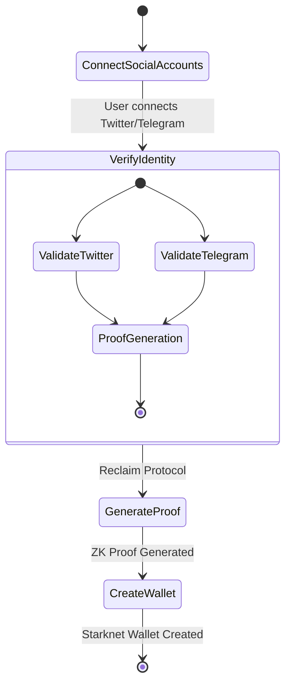
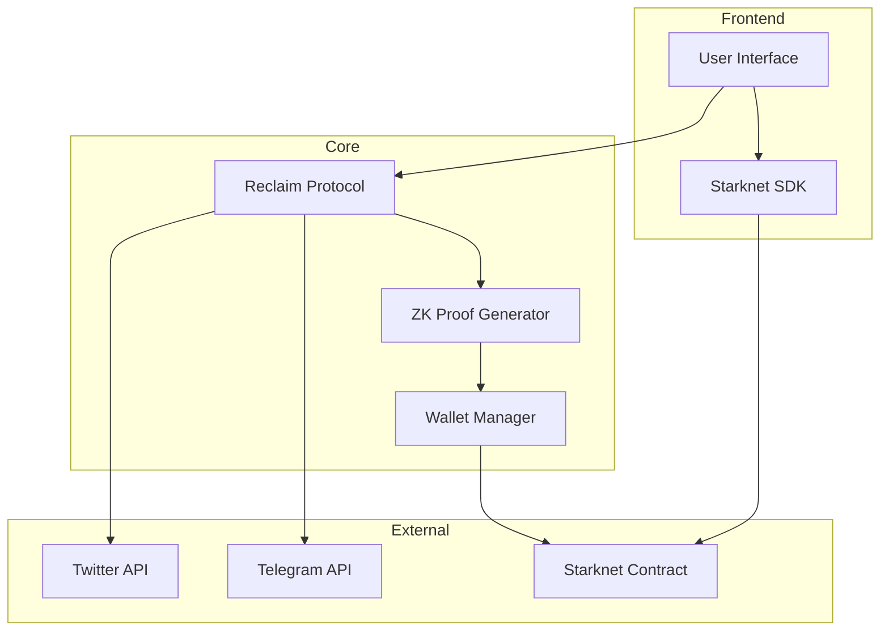
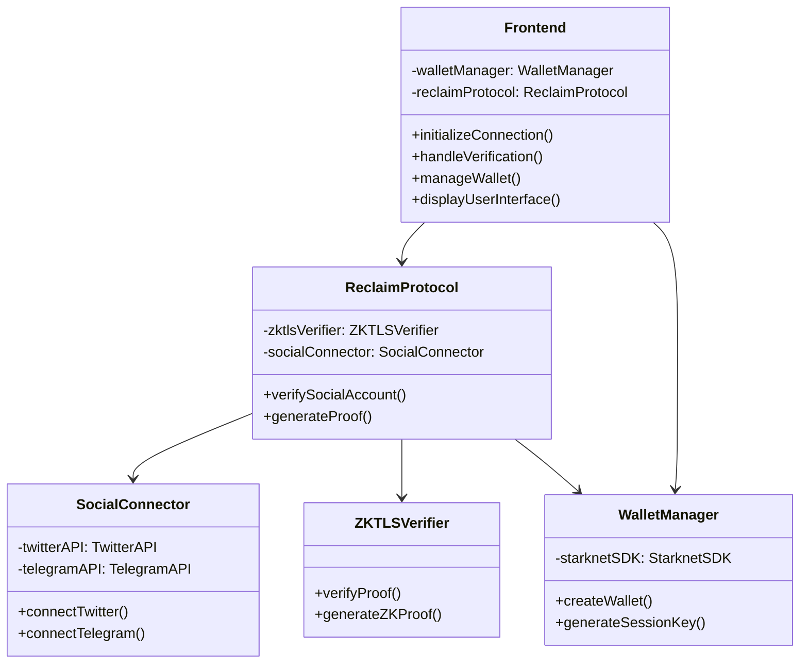
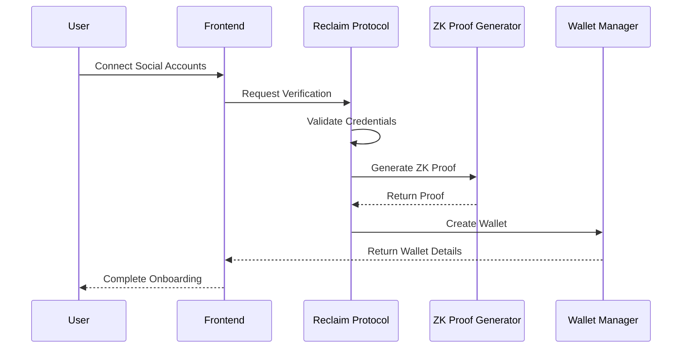

# **Proovacy**  
## **Overview**

Proovacy leverages zkTLS (Zero-Knowledge Transport Layer Security) to privately prove ownership of social media usernames, such as Twitter and Telegram, directly on-chain while ensuring user privacy. By integrating the Starknet Wallet SDK, Proovacy creates a unique wallet based on parameters derived from these platforms. Initially, the system supports verified humans onboarding through Twitter and Telegram, followed by a 2:1 referral model, where each user can invite two verified participants. This decentralized Proof-of-Personhood system not only enables secure verification but also supports generating session keys for privacy-preserving authentication across platforms.

## **Workflows**
### **Activity Diagram**

### **Software Architecture Diagram**

### **Class Diagram**

### **Sequence Diagram**

